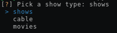
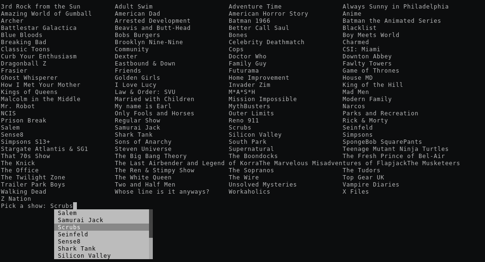

# ArconaiAudio
Allows you to listen to Arconai through your terminal

## Installation

```bash
pip3 install --user ArconaiAudio
```

## Dependencies
You need to install [mpv](https://mpv.io/installation/) as well

### Ubuntu
```bash
sudo add-apt-repository ppa:mc3man/mpv-tests
sudo apt-get install mpv
```

### OS X
```bash
brew install mpv --with-bundle
```

## Usage
In your terminal, run

```bash
ArconaiAudio
```

and you will see a selection



After selection a show type, the relevant show names will be displayed. In the input menu, you can type in the show you want to listen to. Word completion is automatically enabled, so pressing `TAB` will help selection. Selection through `UP` or `DOWN` arrow keys also works.



**NOTE**: Show names are case sensitive


### Options
```bash
ArconaiAudio [show type] [show name]
```

#### Show Type
* shows
* cable
* movies

#### Show Name
The name of the show under the specific **Show Type**. The name is case sensitive, and for names with spaces in the title, you should put quotes around it.

### Example
Running
```bash
ArconaiAudio shows Scrubs
```
will play the **Scrubs** audio

```bash
ArconaiAudio shows "Always Sunny in Philadelphia"
```
will play the **Always Sunny in Philadelphia** audio
